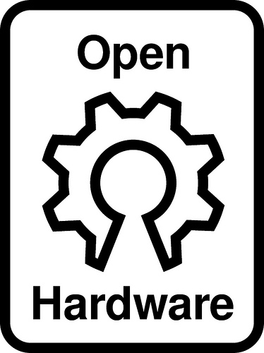

# WiFi Smart Water Pump Controller S1

Introduction

The **WiFi Smart Water Pump Controller S1**  is an innovative device 
engineered to provide seamless control of water pumps through WiFi connectivity. 
Designed to integrate effortlessly with the **WiFi Water Level S1**, this controller 
offers a comprehensive solution for managing water levels and automating pump operations. 
Whether for residential, agricultural, or industrial applications, it enables efficient and remote 
management of water systems.

Please note that this is an incomplete ongoing project. I am moving it from a working project on the development board to 
certified production chips and new SMD components, for easy assembly and production.

The project is open source and open hardware, licensed under GPLv3. All hardware, software, and
3D printable components were designed from scratch by me, **Raul Rodriguez Guardo**, and are released 
under the GPLv3 license, allowing for free use and modification.

  
  

## Hardware part at OSHWLab (ongoing)

[WiFi Smart Water Pump Controller S1](https://oshwlab.com/rrguardo83/automatic-water-pump-for-s1)

---
## FreeCad 3D printable case components

[3D printable case components](3dcase)

For more details about important 3d printing recommendations 
 [read this tips](3dcase/3DPrintReadme.md).

## Disclaimer

This open-source electronics project is provided **"as is."** No warranties of any kind, 
either express or implied, including but not limited to implied warranties of 
merchantability or fitness for a particular purpose, are made. Use this project at 
your own risk. We are not responsible for any damage, loss, or inconvenience that 
may arise from the use of this project.
