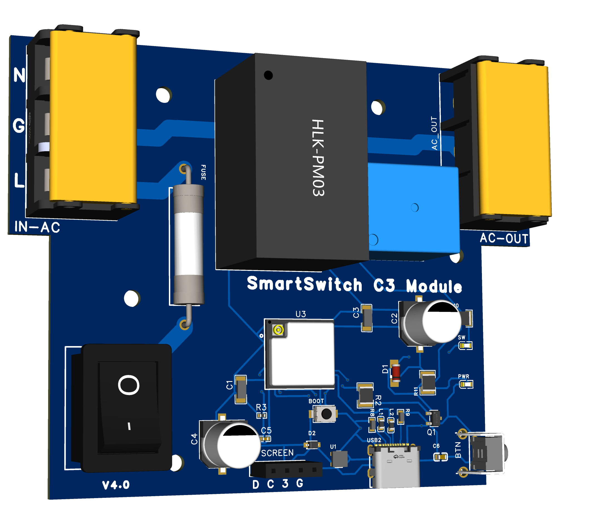
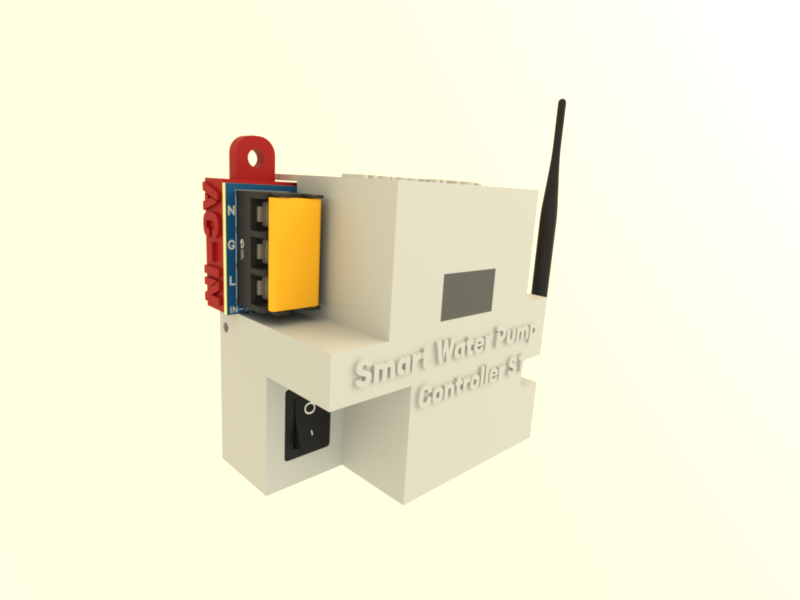

# WiFi Smart Water Pump Controller S1

## Introduction

The [WiFi Smart Water Pump Controller S1](https://waterlevel.pro/products/WiFi-Smart-Water-Pump-Controller-S1)  is an innovative device 
engineered to provide seamless control of water pumps through WiFi connectivity. 
Designed to integrate effortlessly with the [WiFi Water Level S1](https://github.com/rrguardo/WiFi-Water-Level-S1), this controller 
offers a comprehensive solution for managing water levels and automating pump operations. 
Whether for residential, agricultural, or industrial applications, it enables efficient and remote 
management of water systems.

The system is cloud-connected, requiring an internet connection, 
and is designed for reliable, continuous operation. For more details,
refer to the [full features page](https://waterlevel.pro/products/WiFi-Smart-Water-Pump-Controller-S1).

The project is open source and open hardware, licensed under GPLv3. All hardware, software, and
3D printable components were designed from scratch by me, **Raul Rodriguez Guardo**, and are released 
under the GPLv3 license, allowing for free use and modification.

  
  

---

## Hardware part at OSHWLab

[SmartSwitch C3 Module](https://oshwlab.com/rrguardo83/automatic-water-pump-for-s1)

### Where buy the PCB board?
[At OSHWLab project, opening the EasyEDA](https://oshwlab.com/rrguardo83/automatic-water-pump-for-s1) 
editor can in few click buy the entire board with all the PCB components including the components assembly, 
directly from **JLCPCB** and **LCSC** services.

### PCB Component Roles Diagram

---

## Microcontroller Software

[ArduinoIDE INO File](MicrocontrollerCode.ino)

This devide use ESP32-C3 microcontroller can use Arduino IDE to flash/upload microcontroller code, using **ESP32C3 Dev Module** as board.

[Download Latest Firmware Builds Here](SmartPumpControllerS1/firmwares/)

---
## FreeCad 3D printable case components

[3D printable case components](3dcase)

For more details about important 3d printing recommendations 
 [read this tips](3dcase/3DPrintReadme.md).

---

### No 3D Printer? No Problem! Easily Print Parts Using Online 3D Printing Service

| **3D Print Provider**             | **Recommended Materials for Outdoors**                | **Approximate Price**        | **Print Quality**               | **Delivery Options**          | **Comments**                                              |
|--------------------------|-------------------------------------------------------|------------------------------|----------------------------------|-------------------------------|-----------------------------------------------------------|
| **JLCPCB (JLC3DP)**       | Nylon (PA12)                                          | Low to Medium                 | High for resin and MJF           | International, economical      | Great value for money, lacks PETG or ASA options           |
| **Shapeways**             | Nylon, Stainless Steel, Aluminum                      | Medium to High                | Very high, detailed              | International, fast            | Ideal for high-detail projects and outdoor durable parts   |
| **Sculpteo**              | Nylon (PA12), Aluminum, Carbon-Reinforced Nylon       | Medium                        | High                             | International, fast options     | Wide range of materials, good for durable prototypes       |
| **3D Hubs**               | PETG, ABS, Nylon, Carbon Fiber-Reinforced Materials   | Medium                        | High, varies by local provider   | International, varies           | Global network, quality and delivery times vary by provider|
| **Craftcloud**            | PETG, Nylon, ASA, Carbon Fiber-Reinforced Materials   | Medium                        | High, varies by provider         | International, varies           | Service aggregator, good price comparison across providers |
| **Materialise**           | Nylon (PA12), Carbon-Reinforced Nylon, Metals         | High                          | Very high, industrial focus      | International, fast             | Focus on industrial and professional applications          |
| **Xometry**               | Nylon, ABS, PETG, Aluminum, Carbon-Reinforced Nylon   | Medium to High                | Very high, professional focus    | International, fast             | Ideal for custom manufacturing and durable industrial parts|

Choose durable materials like **PETG**, and set **infill at 60%** or higher for added strength. Just upload the 3D files and get everything printed and shipped to you!

---
## User Installation And Usage Manual

The [installation manual](https://waterlevel.pro/manuals/WiFi-Smart-Water-Pump-Controller-S1) provides 
detailed instructions on setting up the **WiFi Smart Water Pump Controller S1**. 
Be sure to [read all instructions](https://waterlevel.pro/manuals/WiFi-Smart-Water-Pump-Controller-S1) 
carefully before proceeding with the installation to ensure proper 
setup and functionality.

[WiFi Smart Water Pump Controller S1 , User Manual](https://waterlevel.pro/manuals/WiFi-Smart-Water-Pump-Controller-S1)

---

## What parts are opensource?

* All the hardware part
  * Electronics part: PCB, schematic.
  * Printable 3D Case
* Firmware software

The server side implementation at https://waterlevel.pro/ (cloud services) that use the device are not 
included in this project or git repo and are not opensource.

---

## Important Disclaimer

> **Disclaimer:**  
This open-source electronics project/device is provided strictly for experimental, educational, and developmental purposes. It is offered "as is," without any warranties, express or implied. This includes, but is not limited to, implied warranties of merchantability, fitness for a particular purpose, or non-infringement.

### By using this device, you acknowledge and accept that:

- You assume all risks associated with its use, including but not limited to potential damage to property, personal injury, or any other unintended consequences.
- This device is not certified for commercial, industrial, or safety-critical applications. It is intended solely for developers, hobbyists, and other users with appropriate technical expertise.
- The creators and distributors of this project are not liable for any damages, losses, or inconveniences resulting from its use, modification, or integration into other systems.

Users are solely responsible for ensuring that the use of this device complies with local laws, regulations, and safety standards in their region.

---

  <h5>Designed in the Dominican Republic 2024-2025</h5>
  

---
